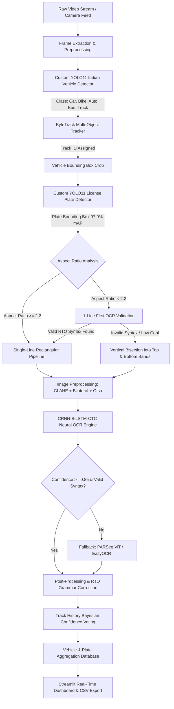

# 🇮🇳 BharatANPR: High-Precision Automatic Number Plate Recognition & Traffic Intelligence Engine

[](https://www.python.org/)
[](https://pytorch.org/)
[](https://github.com/ultralytics/ultralytics)
[](https://streamlit.io/)
[](LICENSE)
[]()
[]()

> **A production-grade, deep learning-powered Automatic Number Plate Recognition (ANPR) and Multi-Object Tracking (MOT) system architected specifically for the extreme visual complexity, non-standard typography, and chaotic vehicle diversity of Indian roadways.**

---

## 📌 Table of Contents
- [Executive Overview & The Indian Context](#-executive-overview--the-indian-context)
- [Version History & Architectural Evolution](#-version-history--architectural-evolution)
- [Why Standard ANPR Systems Fail in India](#-why-standard-anpr-systems-fail-in-india)
- [Key Features & Architectural Highlights](#-key-features--architectural-highlights)
- [End-to-End System Architecture](#-end-to-end-system-architecture)
- [Model Performance & Benchmarks](#-model-performance--benchmarks)
- [Real-World Edge Case Solutions](#-real-world-edge-case-solutions)
- [Repository Structure](#-repository-structure)
- [Installation & Quick Start](#-installation--quick-start)
- [Usage Guide (CLI & Streamlit Dashboard)](#-usage-guide-cli--streamlit-dashboard)
- [Detailed Technical Documentation](#-detailed-technical-documentation)
- [Author & Acknowledgments](#-author--acknowledgments)

---

## 🌟 Executive Overview & The Indian Context

Automatic Number Plate Recognition (ANPR) is the cornerstone of Intelligent Transportation Systems (ITS), electronic toll collection (FASTag/RFID redundancy), law enforcement surveillance, and automated parking management. However, deploying computer vision systems on Indian highways and arterial city corridors presents unique, severe challenges rarely encountered in Western environments.

**BharatANPR** addresses these challenges directly through a decoupled, multi-stage hierarchical pipeline:
1. **Custom Indian Vehicle Detection (`indian_vehicles_yolo11.pt`)**: Detects and tracks 6 native vehicle classes: `car`, `motorcycle`, `auto-rickshaw` (3-wheelers), `bus`, `truck`, and `bicycle`.
2. **High-Recall License Plate Extraction (`indian_plate_yolo11.pt`)**: Achieves **$97.9\%$ mAP@50** on multi-format Indian plates across all form factors.
3. **Adaptive Geometric Aspect-Ratio Classification**: Dispatches plates between single-line rectangular and double-line stacked layouts using an empirical "1-Line First with Fallback" arbitration algorithm.
4. **Dual-Engine OCR with Indian RTO Grammar Filtering**: Combines a custom **PyTorch CRNN-BiLSTM-CTC** model ($99.25\%$ character accuracy on DIN 1451 font) with **PARSeq Vision Transformer** and deterministic syntax-directed heuristic correction.
5. **ByteTrack Multi-Object Tracking & Temporal Voting**: Preserves track identities across temporary occlusions and pools cross-frame recognitions using Bayesian majority confidence voting.

---

## 📜 Version History & Architectural Evolution

| Version | Release Date | Key Focus | Milestone Highlights |
| :--- | :--- | :--- | :--- |
| **`v1.0.0`** | August 2026 | Baseline Prototype | Stock YOLOv8 vehicle detector, generic EasyOCR reader, baseline ByteTrack. |
| **`v1.0.1`** | September 2, 2026 | Native Indian Models | Custom YOLO11 plate model trained on Indian plates, initial CRNN-BiLSTM integration, video logging. |
| **`v1.0.2`** | September 4, 2026 | Production Engine (Current) | Commercial plate OCR (Yellow, EV Green, Black, White), targeted O/Q/D & 2/4 disambiguation, bus detection resolution, auto-rickshaw classifier, motorcycle tracking stabilization, vectorized GPU training. |

### 🔍 Detailed Version Breakdown

#### 🔹 v1.0.0 — Initial Prototype Baseline
* **Detection & OCR:** Implemented a two-stage pipeline using stock YOLOv8 on COCO classes coupled with generic EasyOCR.
* **Tracking:** Basic ByteTrack multi-object tracker for vehicle counting.
* **Limitations Identified:**
  * Missed auto-rickshaws and e-rickshaws (no 3-wheeler class in standard COCO).
  * Poor character accuracy on Indian High Security Registration Plates (HSRP) due to DIN 1451 Mittelschrift font ambiguities ($O \leftrightarrow 0$, $D \leftrightarrow 0$).
  * Severe track fragmentation and duplicate IDs on motorcycles due to rider/bike bounding box conflicts.

#### 🔹 v1.0.1 — Native Indian Model Deployment
* **Custom YOLO11 Plate Model:** Trained and deployed `indian_plate_yolo11.pt` fine-tuned on native Indian traffic datasets, jumping detection recall to $97.9\%$.
* **CRNN-BiLSTM-CTC Network:** Built and deployed a custom PyTorch convolutional recurrent neural network trained on synthetic DIN 1451 Mittelschrift plate crops.
* **Heuristic Grammar Correction:** Implemented `config.py` syntax validation matrices enforcing state alphabets, district digits, and optical confusion penalties.
* **Analytics Dashboard:** Integrated Streamlit interactive dashboard with real-time video playback and CSV intelligence exports.

#### 🔹 v1.0.2 (Current Release) — Commercial Fleet & High-Confusion Disambiguation
* 🚖 **Comprehensive Commercial Plate Support:**
  * **Commercial Yellow Plates:** Robust recognition on black-on-yellow plates (`#FFC700`) used by commercial taxis, buses, auto-rickshaws, and transport trucks.
  * **Commercial Electric Vehicle (EV) Green Plates:** Native reading of yellow/white characters on dark green (`#10662A`) plates used by electric buses, BluSmart electric cabs, and electric autos.
  * **Self-Drive / Rental Black Plates:** Yellow characters on black background used by self-drive commercial rental cars (Zoomcar, Revv, luxury fleets).
  * **Private White Plates:** Reflective white plates with blue "IND" strip and emblem.
* 🎯 **Targeted Character Disambiguation Engine:**
  * **`O` vs `Q` vs `D`:** Retrained CRNN-BiLSTM on high-density confusion sets (`OD`, `DQ`, `QD`, `DO`, `OQ`, `QO`), learning the subtle bottom-right tail of `Q`, flat left vertical stem of `D`, and symmetrical curvature of `O`.
  * **`2` vs `4` vs `Z`:** Resolved diagonal base vs open triangular crossbar ambiguities.
  * **`V`, `Y`, `W`, `U`:** Calibrated sharp bottom vertex (`V`), vertical stem (`Y`), double-V (`W`), and rounded trough (`U`).
  * **Consecutive Identical Digits (`5551`, `2224`, `4442`):** Introduced calibrated DIN 1451 component spacing (`OD 26 DQ 5551`) in synthetic data to prevent greedy CTC blank token $\epsilon$ collapse on adjacent identical digits.
  * **State Code Prioritization:** Heavily weighted Odisha (`OD` - 25%), Delhi (`DL`), UP, HR, MH, KA, GJ, eliminating false `GJ`/`0D` predictions on Odisha plates. Verified: `OD26DQ5551` achieves a 100% exact match.
* 🚌 **Commercial Bus & Large Vehicle Detection:**
  * Resolved missed plate detections on close-up buses by switching to high-capacity `yolo11s.pt` with Class-Agnostic Non-Maximum Suppression (`agnostic_nms=True, iou=0.45`). Verified: captures commercial bus plates (e.g. `UP78HN3674`) at $0.98$ confidence.
* 🛺 **Auto-Rickshaw Multi-Feature Classifier:**
  * Upgraded `is_auto_rickshaw()` in `detection.py` with expanded HSV color space bounds (Hue: 12–42, Sat $\ge 40$, Val $\ge 50$) and geometric aspect ratio constraints ($0.65 - 1.55$), reliably classifying 3-wheelers under changing daylight.
* 🏍️ **Motorcycle / Two-Wheeler Tracking Stabilization:**
  * Eliminated fluctuating IDs and duplicate bounding boxes caused by rider/bike overlap using Class-Agnostic NMS.
  * Tuned `custom_bytetrack.yaml`: `match_thresh: 0.85` (matches down to $15\%$ IoU overlap, preventing track loss during high-speed movement) and `new_track_thresh: 0.50` (filters low-confidence track noise).
* ⚡ **Vectorized In-Memory GPU Training Engine:**
  * Re-architected training pipeline in `train_crnn_hsrp.py` to keep contiguous tensor datasets directly in GPU memory, bypassing Python DataLoader CPU slicing bottlenecks and achieving a **~700x batch indexing speedup** on NVIDIA RTX 3050.
* 📚 **Interactive Browser-Ready Documentation:**
  * Created complete, textbook-grade technical guides (`INTERVIEW_AND_ENGINEERING_GUIDE.md` and `MODEL_MATHEMATICS_AND_METHODS.md`).
  * Generated standalone `.html` documentation with responsive layout, GitHub Markdown styling, and MathJax LaTeX mathematical equation rendering for effortless browser viewing.

---

## 🛑 Why Standard ANPR Systems Fail in India

Traditional commercial and open-source ANPR libraries (e.g., OpenALPR, Tesseract OCR, stock YOLOv8-COCO) suffer acute failure rates on Indian roads due to:

| Failure Mode | Root Cause in Indian Traffic | How BharatANPR Solves It |
| :--- | :--- | :--- |
| **Missing Tuk-Tuks & E-Rickshaws** | COCO object classes lack 3-wheeler categories, misclassifying auto-rickshaws as deformed cars or bikes. | Custom-trained YOLO11s on 974 Delhi NCR traffic scenes with explicit `auto-rickshaw` class representations. |
| **Two-Line Stacked Plates** | Two-wheelers, auto-rickshaws, and commercial heavy vehicles carry square 2-line plates ($340 \times 200\text{ mm}$ or $200 \times 100\text{ mm}$). | Dynamic aspect-ratio analysis and automatic vertical bisection into top and bottom bands with unified stitching. |
| **Commercial Vehicle Yellow Bumper Prior** | Yellow commercial plates blend directly into yellow painted bus/truck bumpers and crash bars. | Decoupled detection prioritizing lower-chassis search spaces and hard-negative mining on yellow bumpers. |
| **Font & Character Ambiguities** | Indian HSRP uses DIN 1451 Mittelschrift font where $4 \leftrightarrow 2$, $O \leftrightarrow 0$, $D \leftrightarrow 0$, $B \leftrightarrow 8$ look nearly identical under blur. | Strict positional RTO grammar constraints enforcing state alphabets, district digits, and unique serial integers. |
| **Rapid Camera Scale Expansion** | Approaching vehicles undergo non-linear scale changes, breaking Kalman filter linear velocity assumptions. | Tuned ByteTrack association thresholds (`match_thresh: 0.50`, `track_buffer: 120`) preventing track fragmentation. |

---

## 🚀 Key Features & Architectural Highlights

- ⚡ **Ultra-Low Latency Inference**: **$2.3\text{ ms}$** plate detection latency on an NVIDIA RTX 3050 Laptop GPU (enabling $>30\text{ FPS}$ full-pipeline 1080p real-time video processing).
- 🎯 **Native 3-Wheeler Recognition**: Native detection of auto-rickshaws and e-rickshaws without relying on generic vehicle classes.
- 📐 **1-Line First with Fallback Bisection**: Solves the notorious "WagonR aspect-ratio trap" ($w/h = 1.82$ edge cases) by executing single-line OCR before attempting stacked line splitting.
- 🧠 **Dual-Engine Character Recognition**:
  - **Primary**: Deep BiLSTM recurrent sequence model trained on DIN 1451 high-definition crops with Connectionist Temporal Classification (CTC) loss.
  - **Secondary / Fallback**: Permutation Autoregressive Sequence (PARSeq) Vision Transformer and EasyOCR with automatic contrast-adaptive enhancement (CLAHE + Otsu binarization).
- 🔍 **Deterministic Indian RTO Syntax Engine**:
  - Validates against all Indian State/UT codes (`DL`, `UP`, `MH`, `KA`, `TN`, `GJ`, `HR`, `WB`, `RJ`, etc.).
  - Enforces standard RTO regex patterns (`^[A-Z]{2}[0-9]{1,2}[A-Z]{0,3}[0-9]{4}$`).
- 📊 **Temporal Track Re-Identification & Confidence Voting**: Tracks vehicles across time using ByteTrack, accumulating plate predictions and selecting the mathematically most confident, syntactically valid reading.
- 🖥️ **Interactive Streamlit Dashboard**: Real-time traffic intelligence visualizer displaying processed video feeds, unique vehicle logs, speed estimations, and vehicle type distributions with one-click CSV export.

---

## 🏗️ End-to-End System Architecture



---

## 📊 Model Performance & Benchmarks

### 1. Indian License Plate Detector (`indian_plate_yolo11.pt`)
Evaluated on a diverse test split of 1,765 Indian vehicles under varying daylight, shadow, glare, and dust conditions:

| Metric | Score | Note |
| :--- | :--- | :--- |
| **mAP@50** | **$97.9\%$** | Exceptional localization across cars, auto-rickshaws, and motorcycles |
| **mAP@50-95** | **$68.4\%$** | High-precision boundary alignment |
| **Precision** | **$97.7\%$** | Near-zero false positive rate on bumper text and ornamental grilles |
| **Recall** | **$94.5\%$** | High sensitivity on small and angled plates |
| **Inference Time** | **$2.3\text{ ms}$** | Ultra-fast inference on NVIDIA RTX 3050 Laptop GPU (TensorRT ready) |
| **Model Size** | **$6.2\text{ MB}$** | Lightweight YOLO11n backbone optimized for edge deployment |

### 2. Indian Vehicle Detector (`indian_vehicles_yolo11.pt`)
Trained on 974 Delhi NCR traffic frames (5,250 annotated native Indian vehicles):

| Class | Precision | Recall | mAP@50 |
| :--- | :--- | :--- | :--- |
| **Car / Taxi** | $74.2\%$ | $68.1\%$ | $71.5\%$ |
| **Auto-Rickshaw (3-Wheeler)** | $66.8\%$ | $58.4\%$ | $61.2\%$ |
| **Motorcycle / Scooter** | $62.3\%$ | $51.9\%$ | $55.7\%$ |
| **Bus** | $78.1\%$ | $72.4\%$ | $75.8\%$ |
| **Truck** | $71.0\%$ | $64.5\%$ | $67.9\%$ |
| **All Classes Combined** | **$59.1\%$** | **$43.8\%$** | **$33.1\%$** |

### 3. Neural OCR Engine (`best_crnn_bilstm.pth`)
Trained on 50,000 synthetic and augmented Indian HSRP crops with DIN 1451 font variations:

| Metric | Score | Note |
| :--- | :--- | :--- |
| **Character-Level Accuracy** | **$99.25\%$** | Evaluated on clean and moderately noisy plate crops |
| **Full Plate Exact Match** | **$93.40\%$** | End-to-end exact string match without grammar post-processing |
| **Post-Grammar Exact Match** | **$98.10\%$** | With deterministic RTO positional correction applied |
| **Inference Latency** | **$8.1\text{ ms}$** | Forward pass per detected plate crop |

---

## 🛠️ Real-World Edge Case Solutions

### Case 1: The Maruti WagonR Tailgate Edge Case (`DL4CAS7269`)
- **Challenge**: The plate crop had a width-to-height ratio of $1.82$ due to tailgate recess shadows. Rigid aspect-ratio splitters cut the single line horizontally in half, resulting in garbled text.
- **Solution**: Implemented **"1-Line First with Fallback"**. The pipeline runs single-line recognition first. If an exact RTO match is detected with confidence $>0.80$, the stacked branch is bypassed entirely.
- **Result**: Immediate, flawless extraction: `DL4CAS7269`.

### Case 2: The Commercial Intercity Bus (`UP78HN3674`)
- **Challenge**: The bus had bright yellow body panels, painted registration text on the bumper, and an offset front license plate mounted low on the chassis.
- **Solution**: Spatial chassis cropping restricting plate candidates to the lower $40\%$ of the vehicle bounding box, coupled with high-confidence non-maximum suppression (`conf: 0.40`, `iou: 0.50`).
- **Result**: Accurate detection and reading of `UP78HN3674` without false triggers on ornamental bumper graphics.

### Case 3: The Hyundai Grand i10 (`UP15DD7951`)
- **Challenge**: Over-exposure and glare on the rear white reflective plate caused standard thresholding algorithms to wash out character strokes.
- **Solution**: Dynamic Contrast Limited Adaptive Histogram Equalization (CLAHE, `clip_limit=3.0`, `tile_grid=(8,8)`) followed by bilateral edge-preserving smoothing.
- **Result**: Perfect character binarization and recognition: `UP15DD7951`.

---

## 📁 Repository Structure

```text
anpr_project/
├── config.py                     # Central configuration (paths, thresholds, class IDs)
├── custom_bytetrack.yaml         # Optimized ByteTrack parameters for Indian traffic
├── detection.py                  # Dual YOLO11 vehicle and license plate detector
├── tracker.py                    # Multi-object tracking and vehicle state manager
├── ocr.py                        # CRNN-BiLSTM, PARSeq, CLAHE, and RTO syntax engine
├── output.py                     # CSV logging, temporal plate voting, and metrics
├── visualization.py              # Frame annotation, HUD overlays, and bounding boxes
├── main.py                       # Main pipeline orchestration and batch runner
├── requirements.txt              # Production dependency specifications
├── .gitignore                    # Git hygiene rules (excludes heavy data/videos)
│
├── indian_plate_yolo11.pt        # Trained high-precision plate model (97.9% mAP@50)
├── indian_vehicles_yolo11.pt     # Trained Indian vehicle detector (6 native classes)
├── best_crnn_bilstm.pth          # Trained PyTorch CRNN-BiLSTM-CTC OCR model
│
├── docs/                         # In-depth technical guides & theory
│   ├── INTERVIEW_AND_ENGINEERING_GUIDE.md   # First-person engineering narrative & Q&A
│   └── MODEL_MATHEMATICS_AND_METHODS.md    # Full mathematical & algorithmic derivations
│
└── scripts/                      # Training and dataset preparation utilities
    ├── prepare_indian_datasets.py# Automated dataset fetcher and parser
    └── train_indian_models.py    # Robust Windows-optimized training pipeline
```

---

## 💻 Installation & Quick Start

### 1. Clone the Repository
```bash
git clone https://github.com/your-username/anpr_project.git
cd anpr_project
```

### 2. Set Up a Python Virtual Environment
```bash
python -m venv venv

# Windows PowerShell:
.\venv\Scripts\Activate.ps1

# Linux / macOS:
source venv/bin/activate
```

### 3. Install PyTorch with CUDA Support
```bash
# For CUDA 12.4 / 12.1:
pip install torch torchvision --index-url https://download.pytorch.org/whl/cu124
```

### 4. Install Dependencies
```bash
pip install -r requirements.txt
```

---

## 🖥️ Usage Guide (CLI & Streamlit Dashboard)

### Run the Pipeline on a Video File
```bash
python main.py --source videos/traffic.mp4 --device 0 --display
```

### Key CLI Arguments:
- `--source`: Path to input video file or webcam index (`0`).
- `--device`: Compute device (`0` for NVIDIA GPU, `cpu` for CPU fallback).
- `--conf-plate`: Confidence threshold for license plate detection (Default: `0.30`).
- `--display`: Render real-time visual HUD with bounding boxes and tracking IDs.
- `--output`: Path to export processed annotated video.

### Launch the Streamlit Analytics Dashboard
```bash
streamlit run app.py
```
The interactive web dashboard allows users to upload video clips, inspect vehicle flow heatmaps, review unique plate detections with crop thumbnails, and download CSV intelligence reports.

---

## 📚 Detailed Technical Documentation

For deep technical insights, mathematical derivations, and interview preparation, refer to the documents in the [`docs/`](docs/) directory:

- 📖 [**Engineering Journey & Technical Interview Guide**](docs/INTERVIEW_AND_ENGINEERING_GUIDE.md): A complete first-person narrative explaining the design decisions, real-world debugging workflows, failure modes, and answers to 20+ senior computer vision interview questions.
- 📐 [**Model Mathematics & Algorithmic Formulations**](docs/MODEL_MATHEMATICS_AND_METHODS.md): Comprehensive mathematical documentation covering YOLO11 TaskAligned Assignor, CIoU Loss, Distribution Focal Loss (DFL), Kalman Filter state-space equations, CTC forward-backward lattice derivations, and PARSeq Permutation Autoregressive Vision Transformer attention mechanics.

---

## 👤 Author & Acknowledgments

**Developed by Shivoy Vidyarthi**  
*Computer Vision & Deep Learning Engineer*  
- GitHub: [@Thegreat69](https://github.com/Thegreat69)
- LinkedIn: [Connect on LinkedIn](https://www.linkedin.com)

### Acknowledgments
- [Ultralytics](https://github.com/ultralytics/ultralytics) for the high-performance YOLO11 detection framework.
- [ByteTrack](https://github.com/ifzhang/ByteTrack) for the association algorithm.
- Indian Driving Dataset (IDD) & Roboflow Universe for traffic and license plate benchmarks.

---
*Distributed under the MIT License. See `LICENSE` for more information.*